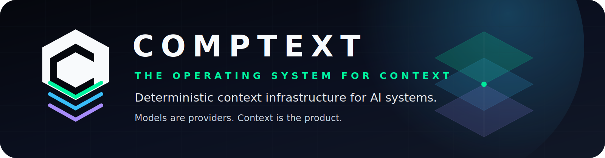
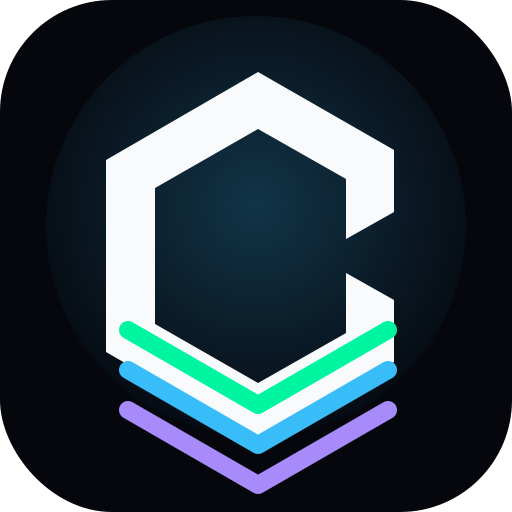
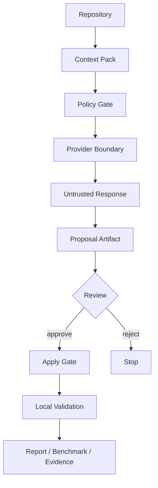

```mermaid
flowchart LR
    P5[Proposal Mode] --> P6[Apply Gate]
    P6 --> P7[Provider Config]
    P7 --> P8[OpenAI-Compatible]
    P8 --> P9[Validate + Benchmark]
    P9 --> P10[Stabilization]
    P10 --> P11[Release Package]
    P11 --> P12[CLI Governance]
    P12 --> P13[Skill Registry]
    P13 --> P14[Hook Integration]
    P14 --> P15[Provenance Engine Cleanup]
    P15 --> P16[Agent State Contract Planning]
```

<p align="center">
  
</p>

# CompText

<p align="center">
  
</p>

<p align="center">
  <strong>The Operating System for Context</strong><br>
  <span>Deterministic context infrastructure for AI systems.</span>
</p>

<p align="center">
  <strong>Models are providers. Context is the product.</strong><br>
  <span>Deterministic. Portable. Verifiable.</span>
</p>

<p align="center">
  <a href="#quickstart">Quickstart</a> ·
  <a href="#why-comptext">Why CompText?</a> ·
  <a href="#artifacts">Artifacts</a> ·
  <a href="#contributing">Contributing</a> ·
  <a href="assets/README.md">Brand Assets</a> ·
  <a href="docs/SKILL_BUNDLE_REGISTRY.md">Skill Registry</a>
</p>

CompText CLI (`ctxt`) is an experimental, local-first terminal tool for turning messy repository state into deterministic, reviewable Context Packs before talking to model providers.

It helps you keep AI-assisted development grounded in artifacts: context packs, request files, proposal JSON, validation output, benchmark records, and phase reports.

CompText is **not** a blind autonomous coding agent. It is a proposal-gated workflow for safer, more inspectable engineering.

---

## Why CompText?

Most AI coding workflows start by sending a lot of vague context to a model and then trusting the conversation.

CompText takes a different path:

1. inspect the repository,
2. build a deterministic Context Pack,
3. pass through explicit policy gates,
4. treat provider output as untrusted,
5. write proposals instead of mutating files immediately,
6. apply only reviewed changes,
7. validate locally,
8. preserve evidence as artifacts.



The goal is simple:

> Less noisy context. More verifiable proof.

---

## Who is this for?

CompText is for developers who want AI-assisted workflows with stronger boundaries:

- Rust / CLI developers experimenting with local-first agent tooling
- prompt engineers building repeatable context workflows
- AI agent developers who care about policy gates and evidence artifacts
- teams exploring provider-agnostic coding workflows
- reviewers who want to see what changed, why, and how it was validated

---

## Current Status

```text
Binary: ctxt
Current phase: Phase 15
Current task: Cryptographic Provenance Engine
Last green phase: Phase 15
Status: complete
Next allowed action: Phase 16 planning on feature branch
```

Completed so far:

```text
Phase 0   Repo Genesis & Bootstrap              COMPLETE
Phase 1   CLI Shell Hardening                    COMPLETE
Phase 2   Context Pack Contract                  COMPLETE
Phase 3   Provider Adapter Layer / Dummy         COMPLETE
Phase 4   Ollama Local Adapter                   COMPLETE
Phase 4B  Skill Registry Normalization           COMPLETE
Phase 4C  Long-Run Autonomy Hardening            COMPLETE
Phase 5   Proposal Mode                          COMPLETE
Phase 6   Apply Gate                             COMPLETE
Phase 7   Provider Config Layer                  COMPLETE
Phase 8   OpenAI-Compatible Adapter              COMPLETE
Phase 9   Validate and Benchmark                 COMPLETE
Phase 10  MVP Stabilization & Release Readiness  COMPLETE
Phase 11  Release Packaging                      COMPLETE
Phase 12  Antigravity CLI Governance & Token Economy COMPLETE
Phase 13  Skill Bundle Registry                  COMPLETE
Phase 14  Hook/Permission Integration            COMPLETE
Phase 15  Cryptographic Provenance Engine        COMPLETE
```

Next areas:

```text
Phase 16  Agent State Contract planning on feature branch
```

### Review-Gate Operating Rules

```text
No NEXT without Review-Gate.
No roadmap completion claim while any phase is blocked.
No automatic phase progression.
Review-Gate decides PASS / PASS WITH NOTES / BLOCKED.
```

Operating modes:

```text
AUDIT           read-only contradiction search
CONSOLIDATE     align README / PROJEKT / reports / docs
FIX             narrow code or documentation repair
REVIEW-GATE     no edits, PASS or BLOCKED only
PHASE WORK      bounded implementation after Review-Gate approval
```

Current Phase 15 cleanup must preserve these boundaries:

```text
local SHA-256 provenance manifests only
raw file content SHA-256 unless canonicalization is implemented
no unsupported assurance claims
no arbitrary path reads or manifest writes outside the repo root
```



---

## Quickstart

### 1. Clone and build

```bash
git clone https://github.com/ProfRandom92/comptext-cli.git
cd comptext-cli
cargo check
```

### 2. Run basic checks

```bash
cargo fmt --all --check
cargo test
cargo clippy -- -D warnings
```

### 3. Try the CLI

```bash
cargo run --bin ctxt -- --help
cargo run --bin ctxt -- doctor
cargo run --bin ctxt -- providers list
cargo run --bin ctxt -- version
```

### 4. Build context artifacts

```bash
cargo run --bin ctxt -- context inspect
cargo run --bin ctxt -- context pack --task "Explain this repository"
```

### 5. Run safe model workflows

```bash
cargo run --bin ctxt -- ask --dry-run "What is the next safe step?"
cargo run --bin ctxt -- ask --provider dummy "How should I test this repo?"
cargo run --bin ctxt -- propose --provider dummy "Add context inspect"
```
