# CompText CLI

**Models are providers. Context is the product.**

**Compress the noise, preserve the proof.**

CompText CLI is an experimental, local-first terminal workflow for building deterministic, schema-checked Context Packs before interacting with model providers.

It is not a blind autonomous coding agent.

It is a proof-preserving context compression and validation workflow for software projects.

---

## What CompText Does

CompText turns noisy project state into structured, reviewable artifacts:

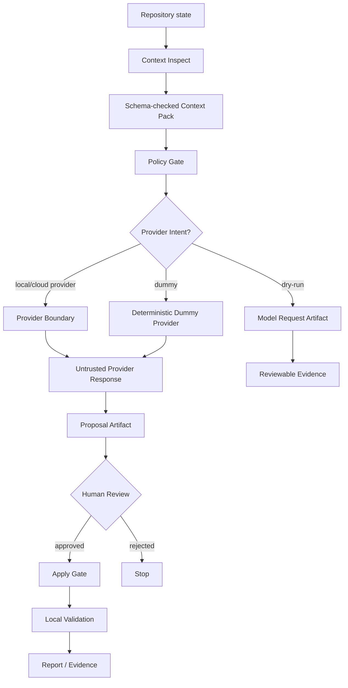

The goal is not to send more context to a model.

The goal is to send the right context, preserve the proof, and keep every risky step reviewable.

---

## Architecture at a Glance

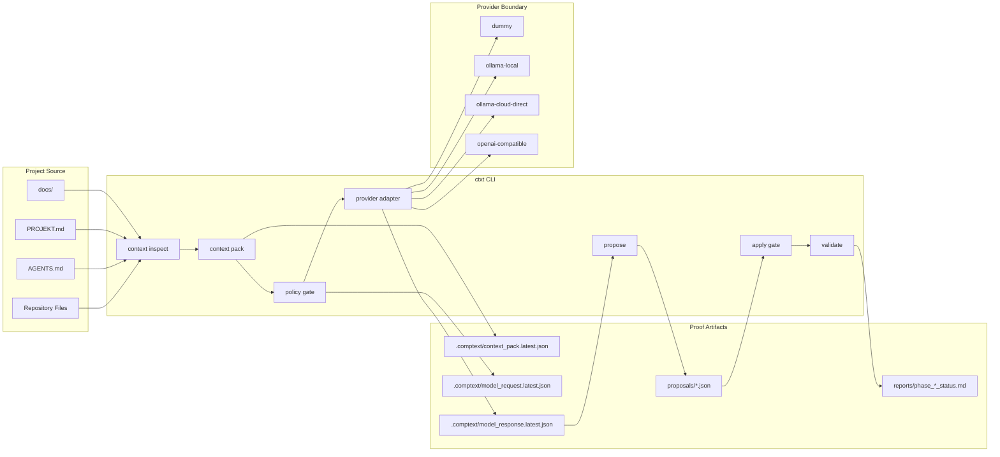

---

## Core Principles

- Deterministic Context Packs before provider calls
- Dry-run before network
- Proposal before apply
- Apply only through policy gate
- Validate before claiming success
- Provider output is untrusted
- Model output is untrusted
- Tool output is untrusted
- Secrets never enter logs, reports, context packs, proposals, snapshots, or stdout/stderr
- Runtime artifacts stay out of source control unless explicitly approved

---

## Trust Boundaries

CompText separates context, provider calls, proposals, and mutation into explicit trust zones.

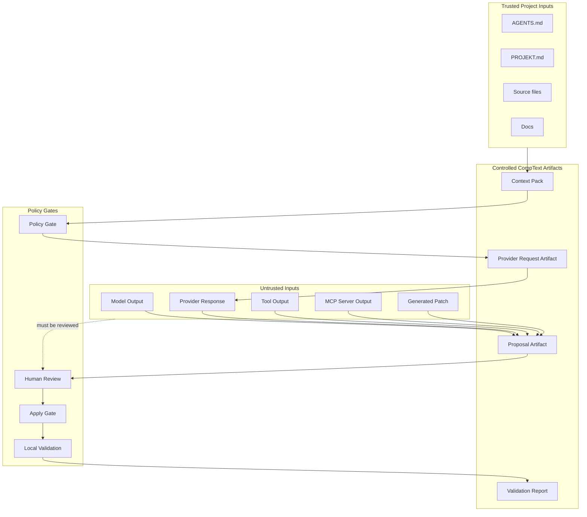

---

## Current Status

```text
Project: CompText CLI
Binary: ctxt
Current phase: Phase 5
Current task: Proposal Mode
Last green phase: Phase 4C
Status: active
```

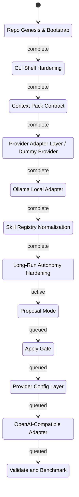

Completed:

```text
Phase 0   Repo Genesis & Bootstrap
Phase 1   CLI Shell Hardening
Phase 2   Context Pack Contract
Phase 3   Provider Adapter Layer / Dummy Provider
Phase 4   Ollama Local Adapter
Phase 4B  Skill Registry Normalization
Phase 4C  Long-Run Autonomy Hardening
```

Active:

```text
Phase 5   Proposal Mode
```

Queued:

```text
Phase 6   Apply Gate
Phase 7   Provider Config Layer
Phase 8   OpenAI-Compatible Adapter
Phase 9   Validate and Benchmark
```

---

## Command Overview

```bash
ctxt --help
ctxt doctor
ctxt version

ctxt providers list

ctxt context inspect
ctxt context pack --task "Explain this repository"

ctxt ask --dry-run "What is the next safe step?"
ctxt ask --provider dummy "How should I test this repo?"
ctxt ask --provider ollama-local --model qwen3:8b "Review this context"

ctxt propose --provider dummy "Add context inspect"

ctxt apply proposals/...
ctxt validate
```

Not every command may be available in the current phase. The roadmap is intentionally phase-gated.

---

## Example Workflow

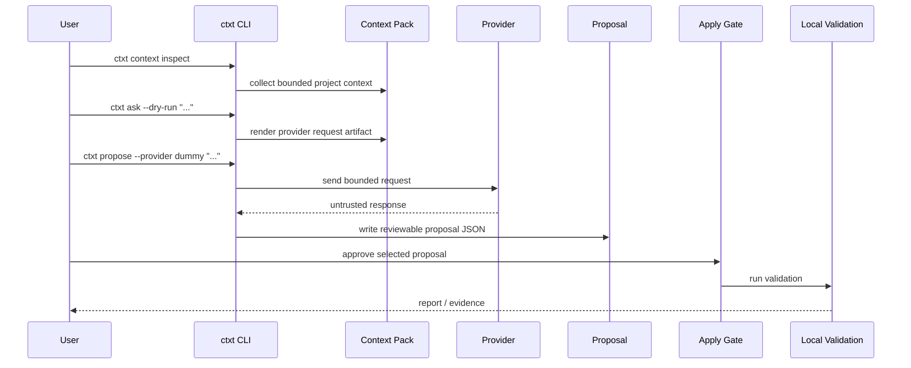

### 1. Inspect the repository context

```bash
ctxt context inspect
```

### 2. Build a Context Pack

```bash
ctxt context pack --task "Add proposal generation mode"
```

This writes a runtime artifact under:

```text
.comptext/context_pack.latest.json
```

### 3. Dry-run the provider request

```bash
ctxt ask --dry-run "What is the next safe implementation step?"
```

Dry-run mode does not call a provider.

It writes an inspectable request artifact under:

```text
.comptext/model_request.latest.json
```

### 4. Use the dummy provider

```bash
ctxt ask --provider dummy "How should I test this repo?"
```

The dummy provider is deterministic, offline, and suitable for CI-style checks.

### 5. Generate a proposal

```bash
ctxt propose --provider dummy "Add context inspect"
```

Proposal mode writes a reviewable artifact under:

```text
proposals/
```

It must not apply changes.

---

## Runtime Artifacts

CompText produces artifacts that help preserve evidence without trusting logs alone.

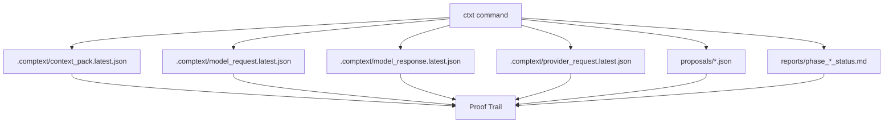

Common runtime paths:

```text
.comptext/context_pack.latest.json
.comptext/model_request.latest.json
.comptext/model_response.latest.json
.comptext/provider_request.latest.json
proposals/
reports/
```

`.comptext/` is runtime state and should normally stay ignored by git.

`proposals/` contains reviewable proposal artifacts.

`reports/` contains phase evidence and validation summaries.

---

## Context Pack Contract

A Context Pack captures the task, selected repository context, policy boundaries, validation commands, and provider intent.

Minimal shape:

```json
{
  "schema_version": "0.1",
  "task": "...",
  "mode": "ask",
  "repo_profile": "default",
  "read_first": [],
  "included_files": [],
  "excluded_files": [],
  "allowed_write_paths": [],
  "forbidden_actions": [],
  "validation_commands": [],
  "provider": null,
  "rendered_context": "...",
  "policy": {
    "secrets_redacted": true,
    "generated_outputs_excluded": true,
    "patch_requires_approval": true
  }
}
```

The Context Pack is the boundary between raw repository noise and model-facing context.

---

## Proposal Artifacts

A proposal is an inspectable artifact.

It is not an applied patch.

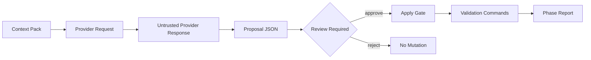

Recommended proposal shape:

```json
{
  "schema_version": "0.1",
  "kind": "comptext.proposal",
  "created_at": "2026-06-04T00:00:00Z",
  "task": "...",
  "phase": "Phase 5",
  "provider": {
    "name": "dummy",
    "network": false,
    "auth": "none"
  },
  "trust": {
    "provider_output_trusted": false,
    "tool_output_trusted": false,
    "requires_human_review": true
  },
  "context": {
    "context_pack_path": ".comptext/context_pack.latest.json",
    "context_pack_hash": "sha256:..."
  },
  "policy": {
    "allowed_write_paths": [],
    "forbidden_actions": [],
    "secrets_redacted": true,
    "network_allowed": false,
    "apply_requires_approval": true
  },
  "proposed_changes": [],
  "validation_commands": [],
  "risks": [],
  "status": "review_required"
}
```

---

## Providers

Planned and supported provider families:

```text
dummy
ollama-local
ollama-cloud-via-local
ollama-cloud-direct
openai-compatible
future-openai
future-gemini
custom
```

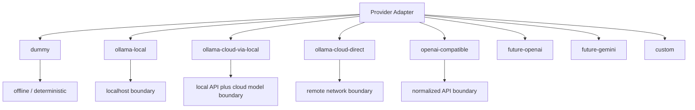

### Dummy Provider

Offline, deterministic, and intended for local testing.

```bash
ctxt ask --provider dummy "Explain the next safe step"
```

### Ollama Local

Local Ollama runs through the local API boundary.

```bash
ctxt ask --provider ollama-local --model qwen3:8b "Review this context"
```

### Ollama Cloud / Direct Cloud

Cloud usage is treated as an explicit network boundary.

Secrets such as `OLLAMA_API_KEY` must never be printed, logged, serialized into artifacts, or included in context packs.

---

## Security Model

CompText treats every external or generated input as untrusted until policy-checked.

Untrusted by default:

```text
provider output
model output
tool output
MCP server output
generated patches
shell commands suggested by a model
```

Forbidden by default:

```text
reading .env
reading private keys
printing environment variables
writing outside allowed paths
running network commands without explicit approval
executing provider-suggested shell commands without review
applying patches outside proposal/apply flow
committing generated runtime outputs by default
```

CompText does not claim to be production-ready, enterprise-ready, compliance-ready, certified, fully autonomous, or guaranteed safe.

---

## Validation

Standard Rust validation:

```bash
cargo fmt --all --check
cargo check
cargo test
cargo clippy -- -D warnings
```

Useful CLI smoke tests:

```bash
cargo run --bin ctxt -- --help
cargo run --bin ctxt -- doctor
cargo run --bin ctxt -- providers list
cargo run --bin ctxt -- version
cargo run --bin ctxt -- context inspect
cargo run --bin ctxt -- ask --dry-run "What is the next safe step?"
cargo run --bin ctxt -- ask --provider dummy "How should I test this repo?"
```

Phase 5 validation:

```bash
cargo run --bin ctxt -- propose --provider dummy "Add context inspect"
```

---

## Project Files

Important files:

```text
AGENTS.md
PROJEKT.md
docs/ARCHITECTURE.md
docs/CONTEXT_PACK_CONTRACT.md
docs/PROVIDER_ADAPTERS.md
docs/SECURITY_MODEL.md
docs/AGENT_OPERATING_MODEL.md
docs/LONG_RUN_AUTONOMY.md
reports/
.comptext/
proposals/
.agent/skills/
.agents/skills/
```

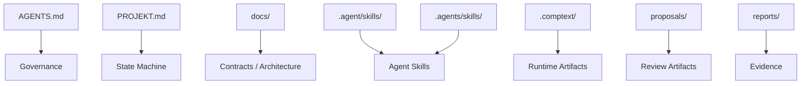

`PROJEKT.md` is the project state machine.

`AGENTS.md` is the safety constitution.

`reports/` contains phase evidence.

`.comptext/` contains ignored runtime artifacts.

`proposals/` contains reviewable proposal artifacts.

---

## Roadmap

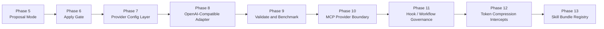

```text
Phase 5   Proposal Mode
Phase 6   Apply Gate
Phase 7   Provider Config Layer
Phase 8   OpenAI-Compatible Adapter
Phase 9   Validate and Benchmark
Phase 10  MCP Provider Boundary
Phase 11  Hook / Workflow Governance
Phase 12  Token Compression Intercepts
Phase 13  Skill Bundle Registry
```

---

## Agent Operating Model

Agents may work autonomously only inside phase-scoped tasks.

Every task must define:

```text
phase name
read-first files
precise goal
allowed files
hard scope
forbidden scope
implementation rules
validation commands
return schema
```

Default implementation rules:

```text
inspect before edit
smallest safe patch
no unrelated changes
no generated output commits
no secrets in logs
no network unless explicitly approved
no git commit unless explicitly approved or phase-required
no git push unless explicitly approved or phase-required
local validation before success
```

Standard return schema:

```text
PHASE:
STATUS:
FILES_CHANGED:
COMMANDS_RUN:
VALIDATION:
ARTIFACTS:
GIT:
NETWORK:
SECRETS:
POLICY_DECISIONS:
RISKS:
NEXT:
```

---

## Repository Separation

CompText is part of a wider project family.

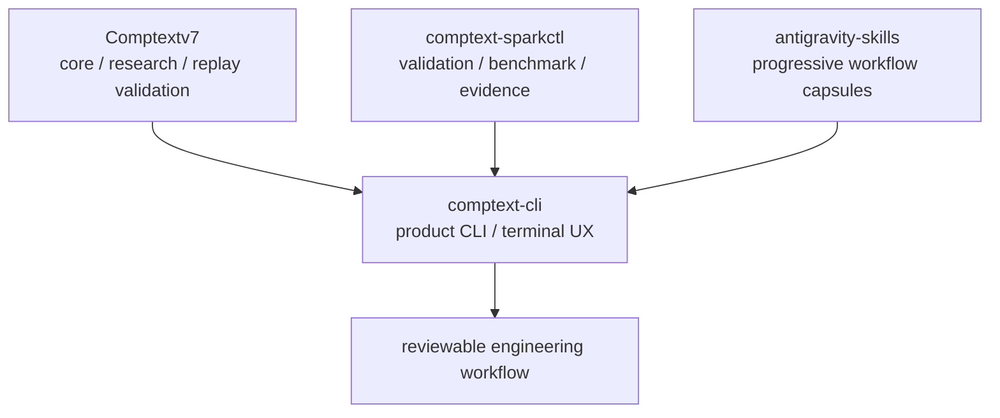

### comptext-cli

Product CLI, terminal UX, provider adapters, Context Packs, proposals, apply gate, validation workflow.

### comptext-sparkctl

Deterministic validation, phase gates, benchmark and evidence layer.

### antigravity-skills

Progressive workflow capsules for phase-scoped agent work.

---

## Development Stance

CompText is built around one practical rule:

```text
Do not trust the conversation.
Trust the artifacts.
```

The CLI should make context smaller, safer, and easier to verify.

Compress the noise.

Preserve the proof.
