# CompText CLI

**Models are providers. Context is the product.**

**Compress the noise, preserve the proof.**

CompText CLI is an experimental, local-first terminal workflow for building deterministic, schema-checked Context Packs before interacting with model providers.

It is not a blind autonomous coding agent.

It is a proof-preserving context compression, proposal, apply, validation, and benchmark workflow for software projects.

---

## What CompText Does

CompText turns noisy project state into structured, reviewable artifacts:

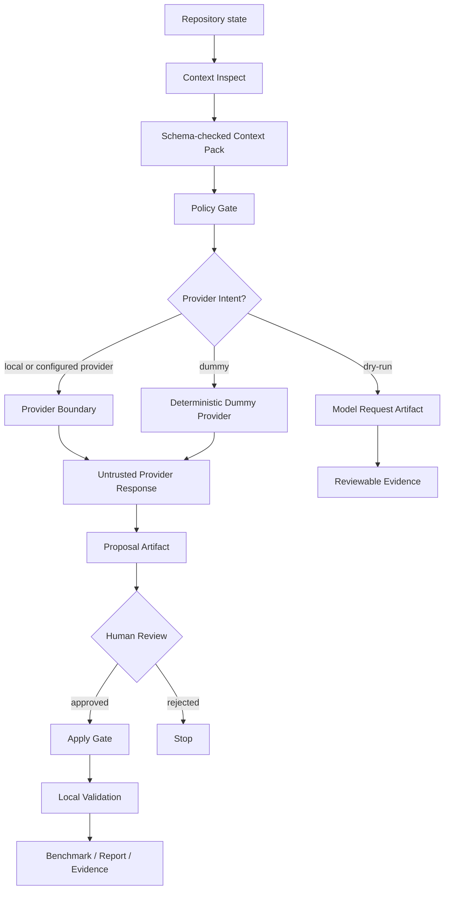

The goal is not to send more context to a model.

The goal is to send the right context, preserve the proof, and keep every risky step reviewable.

---

## Architecture at a Glance

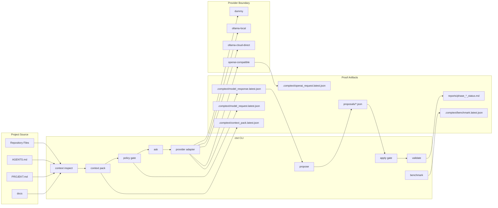

---

## Current Status

```text
Project: CompText CLI
Binary: ctxt
Current phase: Phase 9
Current task: Validate and Benchmark
Last green phase: Phase 9
Status: complete
```

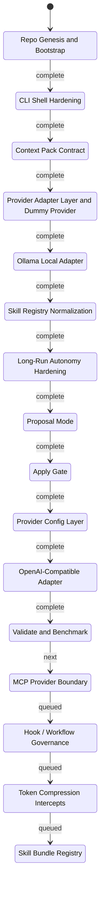

Completed:

```text
Phase 0   Repo Genesis & Bootstrap
Phase 1   CLI Shell Hardening
Phase 2   Context Pack Contract
Phase 3   Provider Adapter Layer / Dummy Provider
Phase 4   Ollama Local Adapter
Phase 4B  Skill Registry Normalization
Phase 4C  Long-Run Autonomy Hardening
Phase 5   Proposal Mode
Phase 6   Apply Gate
Phase 7   Provider Config Layer
Phase 8   OpenAI-Compatible Adapter
Phase 9   Validate and Benchmark
```

Next recommended phases:

```text
Phase 10  MCP Provider Boundary
Phase 11  Hook / Workflow Governance
Phase 12  Token Compression Intercepts
Phase 13  Skill Bundle Registry
```

---

## Implemented Commands

```bash
ctxt --help
ctxt doctor
ctxt version

ctxt providers list

ctxt context inspect
ctxt context pack --task "Explain this repository"

ctxt ask --dry-run "What is the next safe step?"
ctxt ask --provider dummy "How should I test this repo?"
ctxt ask --provider ollama-local "Review this context"
ctxt ask --provider openai-compatible --dry-run "Prepare an OpenAI-compatible request artifact"

ctxt propose --provider dummy "Add context inspect"

ctxt apply proposals/proposal.latest.json --yes
ctxt validate
ctxt benchmark --provider dummy "How should I test this repo?"
```

The workflow is still intentionally phase-gated: live network/provider execution remains controlled by configuration and policy.

---

## Example Workflow

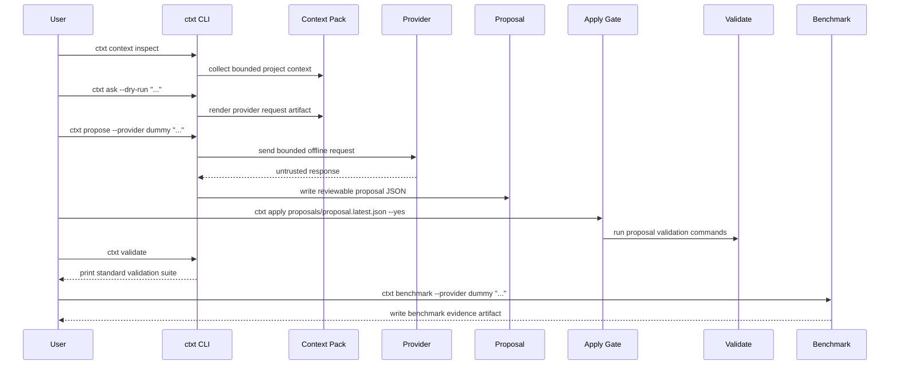

### 1. Inspect the repository context

```bash
ctxt context inspect
```

### 2. Build a Context Pack

```bash
ctxt context pack --task "Add proposal generation mode"
```

This writes:

```text
.comptext/context_pack.latest.json
```

### 3. Dry-run a provider request

```bash
ctxt ask --dry-run "What is the next safe implementation step?"
```

Dry-run mode does not call a provider. It writes:

```text
.comptext/model_request.latest.json
```

### 4. Use the dummy provider

```bash
ctxt ask --provider dummy "How should I test this repo?"
```

The dummy provider is deterministic, offline, and suitable for CI-style checks.

### 5. Generate a proposal

```bash
ctxt propose --provider dummy "Add context inspect"
```

This writes:

```text
proposals/proposal_<task_slug>.json
proposals/proposal.latest.json
```

### 6. Apply a reviewed proposal

```bash
ctxt apply proposals/proposal.latest.json --yes
```

Apply checks allowed paths and runs the proposal validation commands after applying operations.

### 7. Print validation commands

```bash
ctxt validate
```

### 8. Run an offline deterministic benchmark

```bash
ctxt benchmark --provider dummy "How should I test this repo?"
```

This writes:

```text
.comptext/benchmark.latest.json
```

---

## Runtime Artifacts

CompText produces artifacts that preserve evidence without trusting conversation logs alone.

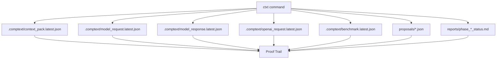

Common runtime paths:

```text
.comptext/context_pack.latest.json
.comptext/model_request.latest.json
.comptext/model_response.latest.json
.comptext/openai_request.latest.json
.comptext/benchmark.latest.json
proposals/
reports/
```

`.comptext/` is runtime state and should normally stay ignored by git.

`proposals/` contains reviewable proposal artifacts.

`reports/` contains phase evidence and validation summaries.

---

## Context Pack Contract

A Context Pack captures the task, selected repository context, policy boundaries, validation commands, and provider intent.

Minimal shape:

```json
{
  "schema_version": "0.1",
  "task": "...",
  "mode": "ask",
  "repo_profile": "default",
  "read_first": [],
  "included_files": [],
  "excluded_files": [],
  "allowed_write_paths": [],
  "forbidden_actions": [],
  "validation_commands": [],
  "provider": "dummy",
  "rendered_context": "...",
  "policy": {
    "secrets_redacted": true,
    "generated_outputs_excluded": true,
    "patch_requires_approval": true
  }
}
```

The Context Pack is the boundary between raw repository noise and model-facing context.

---

## Proposal and Apply Flow

A proposal is an inspectable artifact.

It is not automatically applied.

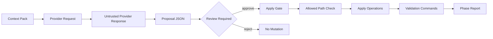

Current proposal shape:

```json
{
  "schema_version": "0.1",
  "task": "...",
  "rationale": "...",
  "preconditions": ["cargo check"],
  "affected_files": ["src/cli.rs"],
  "operations": [
    {
      "op": "patch",
      "path": "src/cli.rs",
      "detail": "..."
    }
  ],
  "validation_commands": ["cargo test"],
  "rollback_strategy": "git restore src/cli.rs",
  "risk_notes": "..."
}
```

Apply gate behavior:

```text
- reads an explicit proposal file or proposals/proposal.latest.json
- validates operation paths against allowed write rules
- asks for confirmation unless --yes is supplied
- applies supported operations
- runs proposal validation commands
- fails closed on policy or validation errors
```

---

## Providers and Configuration

Configured provider families:

```text
dummy
ollama-local
ollama-cloud-via-local
ollama-cloud-direct
openai-compatible
```

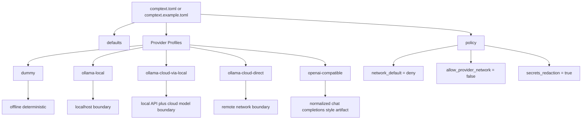

Example provider config:

```toml
[defaults]
provider = "dummy"
dry_run_default = true
proposal_required = true

[providers.dummy]
kind = "dummy"
network = false

[providers.ollama-local]
kind = "ollama"
base_url = "http://localhost:11434"
auth = "none"

[providers.openai-compatible]
kind = "openai-compatible"
base_url = "http://localhost:11434/v1"
model = "gpt-4o"
auth_env = "OPTIONAL_API_KEY"
network = false

[policy]
network_default = "deny"
allow_provider_network = false
secrets_redaction = true
apply_requires_confirmation = true
```

### Dummy Provider

Offline, deterministic, and intended for local testing.

```bash
ctxt ask --provider dummy "Explain the next safe step"
```

### Ollama Local

Local Ollama runs through the local API boundary.

```bash
ctxt ask --provider ollama-local "Review this context"
```

### OpenAI-Compatible Adapter

The OpenAI-compatible adapter can produce normalized request artifacts and is gated by provider config and network policy.

```bash
ctxt ask --provider openai-compatible --dry-run "Prepare request artifact"
```

### Cloud / Direct Cloud

Cloud usage is treated as an explicit network boundary.

Secrets such as `OLLAMA_API_KEY` must never be printed, logged, serialized into artifacts, or included in context packs.

---

## Validate and Benchmark

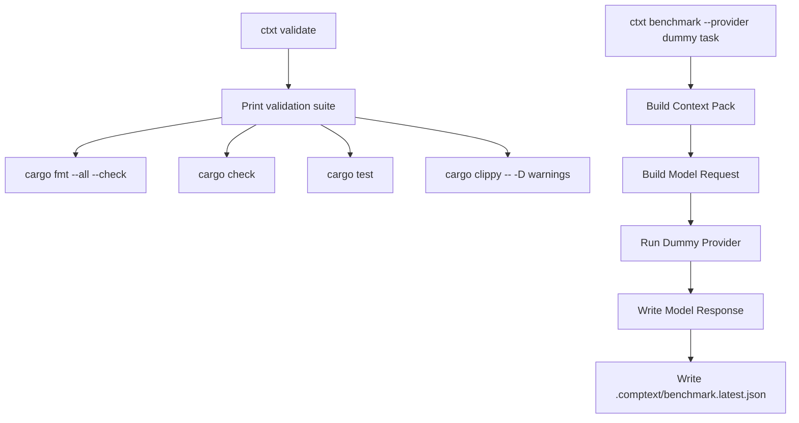

`ctxt validate` prints the standard local validation suite:

```bash
cargo fmt --all --check
cargo check
cargo test
cargo clippy -- -D warnings
```

`ctxt benchmark` currently supports the offline `dummy` provider and fails closed for non-dummy providers in this phase.

Phase 9 evidence records:

```text
- cargo fmt --all --check
- cargo check
- cargo test
- cargo clippy -- -D warnings
- cargo run --bin ctxt -- validate
- cargo run --bin ctxt -- benchmark --provider dummy "How should I test this repo?"
- all 35 tests passed
- network: offline-only
- secrets: redacted
```

---

## Security Model

CompText treats every external or generated input as untrusted until policy-checked.

Untrusted by default:

```text
provider output
model output
tool output
MCP server output
generated patches
shell commands suggested by a model
```

Forbidden by default:

```text
reading .env
reading private keys
printing environment variables
writing outside allowed paths
running network commands without explicit approval
executing provider-suggested shell commands without review
applying patches outside proposal/apply flow
committing generated runtime outputs by default
```

CompText does not claim to be production-ready, enterprise-ready, compliance-ready, certified, fully autonomous, or guaranteed safe.

---

## Project Files

Important files:

```text
AGENTS.md
PROJEKT.md
comptext.example.toml
docs/ARCHITECTURE.md
docs/CONTEXT_PACK_CONTRACT.md
docs/PROVIDER_ADAPTERS.md
docs/SECURITY_MODEL.md
docs/AGENT_OPERATING_MODEL.md
docs/LONG_RUN_AUTONOMY.md
docs/VALIDATE_BENCHMARK.md
reports/
.comptext/
proposals/
.agent/skills/
.agents/skills/
```

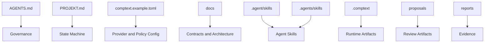

`PROJEKT.md` is the project state machine.

`AGENTS.md` is the safety constitution.

`reports/` contains phase evidence.

`.comptext/` contains ignored runtime artifacts.

`proposals/` contains reviewable proposal artifacts.

---

## Roadmap

```mermaid
flowchart LR
    P0[Phase 0 Complete] --> P1[Phase 1 Complete]
    P1 --> P2[Phase 2 Complete]
    P2 --> P3[Phase 3 Complete]
    P3 --> P4[Phase 4 Complete]
    P4 --> P4B[Phase 4B Complete]
    P4B --> P4C[Phase 4C Complete]
    P4C --> P5[Phase 5 Complete]
    P5 --> P6[Phase 6 Complete]
    P6 --> P7[Phase 7 Complete]
    P7 --> P8[Phase 8 Complete]
    P8 --> P9[Phase 9 Complete]
    P9 --> P10[Phase 10 Next MCP Boundary]
    P10 --> P11[Phase 11 Hook Governance]
    P11 --> P12[Phase 12 Token Compression]
    P12 --> P13[Phase 13 Skill Bundle Registry]
```

```text
Phase 0   Repo Genesis & Bootstrap              COMPLETE
Phase 1   CLI Shell Hardening                    COMPLETE
Phase 2   Context Pack Contract                  COMPLETE
Phase 3   Provider Adapter Layer / Dummy         COMPLETE
Phase 4   Ollama Local Adapter                   COMPLETE
Phase 4B  Skill Registry Normalization           COMPLETE
Phase 4C  Long-Run Autonomy Hardening            COMPLETE
Phase 5   Proposal Mode                          COMPLETE
Phase 6   Apply Gate                             COMPLETE
Phase 7   Provider Config Layer                  COMPLETE
Phase 8   OpenAI-Compatible Adapter              COMPLETE
Phase 9   Validate and Benchmark                 COMPLETE
Phase 10  MCP Provider Boundary                  NEXT
Phase 11  Hook / Workflow Governance             QUEUED
Phase 12  Token Compression Intercepts           QUEUED
Phase 13  Skill Bundle Registry                  QUEUED
```

---

## Agent Operating Model

Agents may work autonomously only inside phase-scoped tasks.

Every task must define:

```text
phase name
read-first files
precise goal
allowed files
hard scope
forbidden scope
implementation rules
validation commands
return schema
```

Default implementation rules:

```text
inspect before edit
smallest safe patch
no unrelated changes
no generated output commits
no secrets in logs
no network unless explicitly approved
no git commit unless explicitly approved or phase-required
no git push unless explicitly approved or phase-required
local validation before success
```

Standard return schema:

```text
PHASE:
STATUS:
FILES_CHANGED:
COMMANDS_RUN:
VALIDATION:
ARTIFACTS:
GIT:
NETWORK:
SECRETS:
POLICY_DECISIONS:
RISKS:
NEXT:
```

---

## Repository Separation

CompText is part of a wider project family.

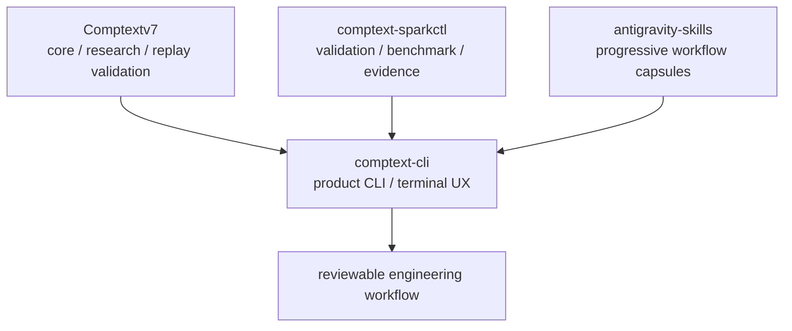

### comptext-cli

Product CLI, terminal UX, provider adapters, Context Packs, proposals, apply gate, validation workflow, and offline benchmark artifacts.

### comptext-sparkctl

Deterministic validation, phase gates, benchmark and evidence layer.

### antigravity-skills

Progressive workflow capsules for phase-scoped agent work.

---

## Development Stance

CompText is built around one practical rule:

```text
Do not trust the conversation.
Trust the artifacts.
```

The CLI should make context smaller, safer, and easier to verify.

Compress the noise.

Preserve the proof.
