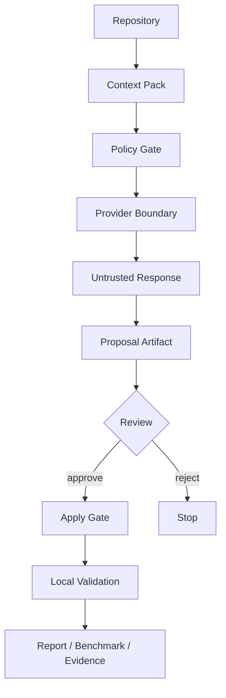
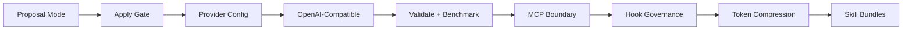
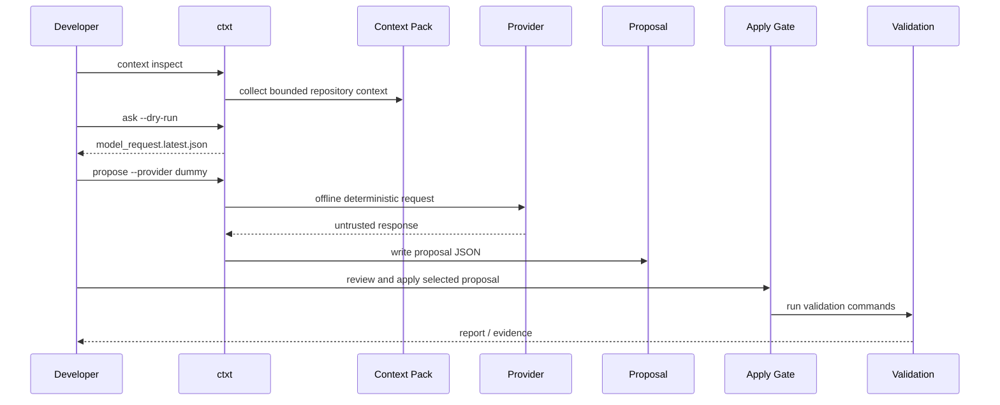
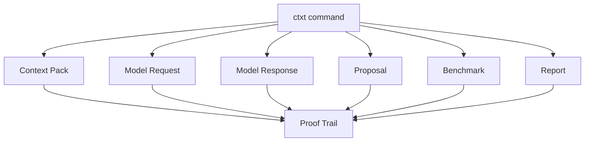
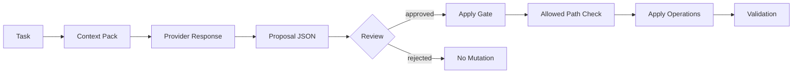
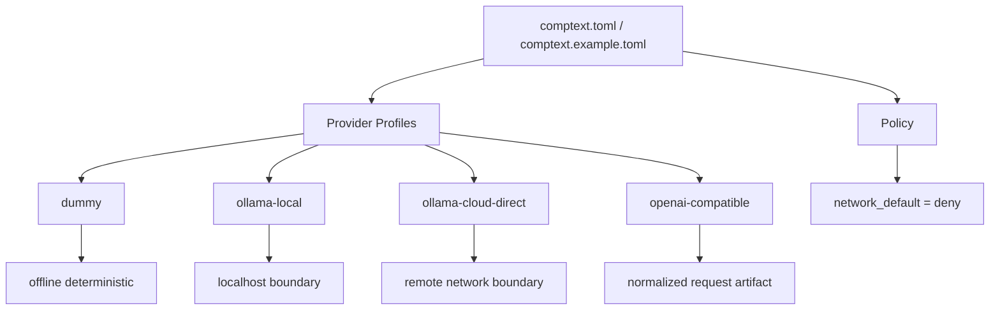
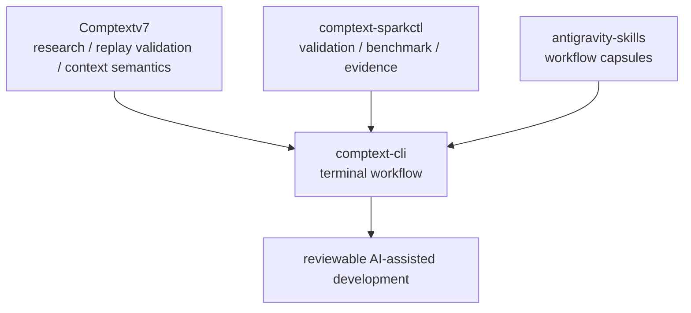

# CompText CLI

**Models are providers. Context is the product.**

**Compress the noise, preserve the proof.**

CompText CLI (`ctxt`) is an experimental, local-first terminal tool for turning messy repository state into deterministic, reviewable Context Packs before talking to model providers.

It helps you keep AI-assisted development grounded in artifacts: context packs, request files, proposal JSON, validation output, benchmark records, and phase reports.

CompText is **not** a blind autonomous coding agent. It is a proposal-gated workflow for safer, more inspectable engineering.

---

## Why CompText?

Most AI coding workflows start by sending a lot of vague context to a model and then trusting the conversation.

CompText takes a different path:

1. inspect the repository,
2. build a deterministic Context Pack,
3. pass through explicit policy gates,
4. treat provider output as untrusted,
5. write proposals instead of mutating files immediately,
6. apply only reviewed changes,
7. validate locally,
8. preserve evidence as artifacts.



The goal is simple:

> Less noisy context. More verifiable proof.

---

## Who is this for?

CompText is for developers who want AI-assisted workflows with stronger boundaries:

- Rust / CLI developers experimenting with local-first agent tooling
- prompt engineers building repeatable context workflows
- AI agent developers who care about policy gates and evidence artifacts
- teams exploring provider-agnostic coding workflows
- reviewers who want to see what changed, why, and how it was validated

---

## Current Status

```text
Binary: ctxt
Current phase: Phase 9
Current task: Validate and Benchmark
Last green phase: Phase 9
Status: complete
```

Completed so far:

```text
Phase 0   Repo Genesis & Bootstrap              COMPLETE
Phase 1   CLI Shell Hardening                    COMPLETE
Phase 2   Context Pack Contract                  COMPLETE
Phase 3   Provider Adapter Layer / Dummy         COMPLETE
Phase 4   Ollama Local Adapter                   COMPLETE
Phase 4B  Skill Registry Normalization           COMPLETE
Phase 4C  Long-Run Autonomy Hardening            COMPLETE
Phase 5   Proposal Mode                          COMPLETE
Phase 6   Apply Gate                             COMPLETE
Phase 7   Provider Config Layer                  COMPLETE
Phase 8   OpenAI-Compatible Adapter              COMPLETE
Phase 9   Validate and Benchmark                 COMPLETE
```

Next areas:

```text
Phase 10  MCP Provider Boundary                  NEXT
Phase 11  Hook / Workflow Governance             QUEUED
Phase 12  Token Compression Intercepts           QUEUED
Phase 13  Skill Bundle Registry                  QUEUED
```



---

## Quickstart

### 1. Clone and build

```bash
git clone https://github.com/ProfRandom92/comptext-cli.git
cd comptext-cli
cargo check
```

### 2. Run basic checks

```bash
cargo fmt --all --check
cargo test
cargo clippy -- -D warnings
```

### 3. Try the CLI

```bash
cargo run --bin ctxt -- --help
cargo run --bin ctxt -- doctor
cargo run --bin ctxt -- providers list
cargo run --bin ctxt -- version
```

### 4. Build context artifacts

```bash
cargo run --bin ctxt -- context inspect
cargo run --bin ctxt -- context pack --task "Explain this repository"
```

### 5. Run safe model workflows

```bash
cargo run --bin ctxt -- ask --dry-run "What is the next safe step?"
cargo run --bin ctxt -- ask --provider dummy "How should I test this repo?"
cargo run --bin ctxt -- propose --provider dummy "Add context inspect"
```

### 6. Validate and benchmark

```bash
cargo run --bin ctxt -- validate
cargo run --bin ctxt -- benchmark --provider dummy "How should I test this repo?"
```

---

## Implemented Commands

```bash
ctxt --help
ctxt doctor
ctxt version
ctxt providers list

ctxt context inspect
ctxt context pack --task "..."

ctxt ask --dry-run "..."
ctxt ask --provider dummy "..."
ctxt ask --provider ollama-local "..."
ctxt ask --provider openai-compatible --dry-run "..."

ctxt propose --provider dummy "..."
ctxt apply proposals/proposal.latest.json --yes

ctxt validate
ctxt benchmark --provider dummy "..."
```

Live provider usage is intentionally gated by configuration and policy. Offline/dummy workflows are the default path for local development and CI-style checks.

---

## Typical Workflow



---

## Artifacts

CompText is built around inspectable files rather than conversation memory.

Common artifacts:

```text
.comptext/context_pack.latest.json
.comptext/model_request.latest.json
.comptext/model_response.latest.json
.comptext/openai_request.latest.json
.comptext/benchmark.latest.json
proposals/proposal.latest.json
reports/phase_*_status.md
```



`.comptext/` is runtime state and should normally stay ignored by git.

`proposals/` contains reviewable change proposals.

`reports/` contains phase evidence and validation summaries.

---

## Context Packs

A Context Pack is the model-facing boundary between raw repository noise and structured task context.

Minimal shape:

```json
{
  "schema_version": "0.1",
  "task": "...",
  "mode": "ask",
  "repo_profile": "default",
  "read_first": [],
  "included_files": [],
  "excluded_files": [],
  "allowed_write_paths": [],
  "forbidden_actions": [],
  "validation_commands": [],
  "provider": "dummy",
  "rendered_context": "...",
  "policy": {
    "secrets_redacted": true,
    "generated_outputs_excluded": true,
    "patch_requires_approval": true
  }
}
```

---

## Proposal and Apply

CompText separates suggestion from mutation.

`propose` writes a JSON proposal.

`apply` reads a selected proposal, checks allowed paths, asks for confirmation unless `--yes` is used, applies supported operations, and runs validation commands.



Current proposal shape:

```json
{
  "schema_version": "0.1",
  "task": "...",
  "rationale": "...",
  "preconditions": ["cargo check"],
  "affected_files": ["src/cli.rs"],
  "operations": [
    {
      "op": "patch",
      "path": "src/cli.rs",
      "detail": "..."
    }
  ],
  "validation_commands": ["cargo test"],
  "rollback_strategy": "git restore src/cli.rs",
  "risk_notes": "..."
}
```

---

## Providers

Configured provider families:

```text
dummy
ollama-local
ollama-cloud-via-local
ollama-cloud-direct
openai-compatible
```



Example:

```toml
[defaults]
provider = "dummy"
dry_run_default = true
proposal_required = true

[providers.dummy]
kind = "dummy"
network = false

[providers.ollama-local]
kind = "ollama"
base_url = "http://localhost:11434"
auth = "none"

[providers.openai-compatible]
kind = "openai-compatible"
base_url = "http://localhost:11434/v1"
model = "gpt-4o"
auth_env = "OPTIONAL_API_KEY"
network = false

[policy]
network_default = "deny"
allow_provider_network = false
secrets_redaction = true
apply_requires_confirmation = true
```

Secrets such as `OLLAMA_API_KEY` must never be printed, logged, serialized into artifacts, or included in context packs.

---

## Validate and Benchmark

`ctxt validate` prints the standard local validation suite:

```bash
cargo fmt --all --check
cargo check
cargo test
cargo clippy -- -D warnings
```

`ctxt benchmark` currently supports the offline `dummy` provider and fails closed for non-dummy providers in this phase.

Phase 9 evidence records:

```text
35 tests passed
network: offline-only
secrets: redacted
benchmark artifact: .comptext/benchmark.latest.json
```

---

## Safety Model

CompText treats generated or external content as untrusted until policy-checked.

Untrusted by default:

```text
provider output
model output
tool output
MCP server output
generated patches
shell commands suggested by a model
```

Forbidden by default:

```text
reading .env
reading private keys
printing environment variables
writing outside allowed paths
running network commands without explicit approval
executing provider-suggested shell commands without review
applying patches outside proposal/apply flow
committing generated runtime outputs by default
```

CompText does not claim to be production-ready, enterprise-ready, compliance-ready, certified, fully autonomous, or guaranteed safe.

---

## Project Map

```text
AGENTS.md                         safety constitution
PROJEKT.md                        project state machine
comptext.example.toml             provider and policy config example
docs/                             architecture and contracts
reports/                          phase evidence
.comptext/                        local runtime artifacts
proposals/                        reviewable proposal artifacts
.agent/skills/                    agent workflow skills
.agents/skills/                   normalized skill registry
```

---

## Contributing

Small, focused contributions are preferred.

Good first contribution areas:

- docs cleanup
- smoke tests
- CLI help text
- proposal schema improvements
- safer validation behavior
- provider config examples
- benchmark artifact improvements

Before opening a PR or committing a phase change, run:

```bash
cargo fmt --all --check
cargo check
cargo test
cargo clippy -- -D warnings
```

Please avoid:

- unrelated rewrites
- live cloud calls in tests
- committing `.comptext/` runtime outputs
- adding secrets or credentials
- production/enterprise/compliance claims

---

## Related Project Family



- `comptext-cli`: product CLI, terminal UX, provider adapters, Context Packs, proposals, apply gate, validation workflow, and offline benchmark artifacts
- `comptext-sparkctl`: deterministic validation, phase gates, benchmark and evidence layer
- `antigravity-skills`: progressive workflow capsules for phase-scoped agent work

---

## Development Stance

```text
Do not trust the conversation.
Trust the artifacts.
```

Compress the noise.

Preserve the proof.
