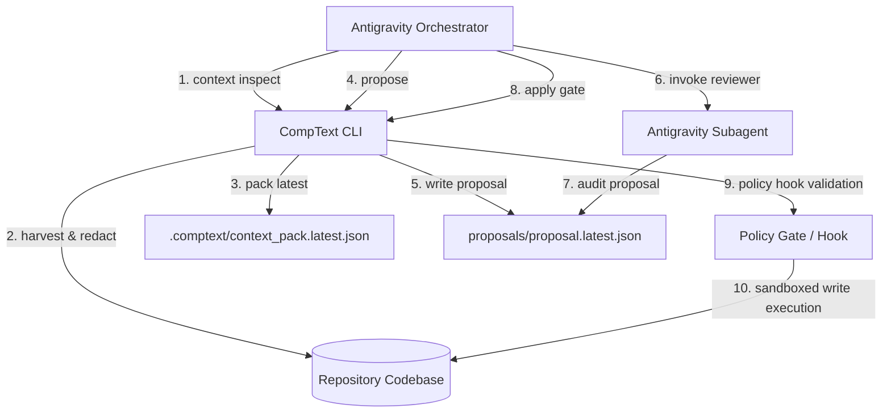

# Antigravity CLI Integration Model

This document outlines the integration architecture and operational boundaries between the **Antigravity Framework** (the Agent Execution Surface) and the **CompText CLI** (the Context, Policy, and Evidence Control Plane).

---

## 1. Core Doctrine

CompText operates under a strict separation of concerns between agent execution and context governance:

- **Antigravity CLI is the Agent Execution Surface**: Handles task orchestration, command execution, tool invocations, and subagent lifecycle management.
- **CompText CLI (`ctxt`) is the Context, Policy, and Evidence Control Plane**: Manages deterministic context packaging, proposal audits, file-write validation gates, and safety constraints.
- **Skills are progressive context-loading capsules**: Bounded guidelines designed to prevent context bloat and restrict agent operations.
- **Hooks are policy-interceptor targets**: Structural interception points allowing verification before, during, and after agent activities.
- **Permissions are defense-in-depth, not the source of truth**: Hard platform sandboxing boundaries that back up (but do not replace) the repository safety constitution.
- **Subagents are bounded specialist reviewers**: Highly targeted, read-only assistants delegated for review rather than autonomous development.
- **The source of truth remains the code repository**: Safety constitution (`AGENTS.md`), project tracker (`PROJEKT.md`), CompText configurations, the Proposal/Apply Gate, and local validation commands.

---

## 2. Structural Interaction

---

## 3. Operational Flow

1. **Context Harvesting**: Before launching a task, the Antigravity Orchestrator executes `ctxt context pack --task "<task_description>"`. This harvest sanitizes the repository state, redacting secrets and building a deterministic Context Pack under `.comptext/context_pack.latest.json`.
2. **Proposal Generation**: When proposing changes, the agent runs `ctxt propose --provider dummy "<prompt>"`. This creates a structured JSON patch proposal under `proposals/` without mutating source files. Note that `proposals/` contains ignored/generated runtime state and is excluded from Git tracking in the release package baseline.
3. **Apply and Verification**: To modify the codebase, the agent calls `ctxt apply <proposal_path>`. The CompText control plane intercepts the request, validates that target files lie within allowed write boundaries, prompts for user confirmation (or validation suite success), applies the patches, and runs local tests.
